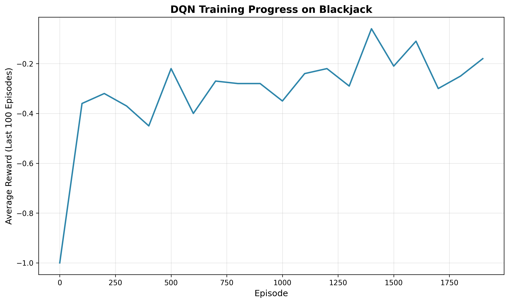
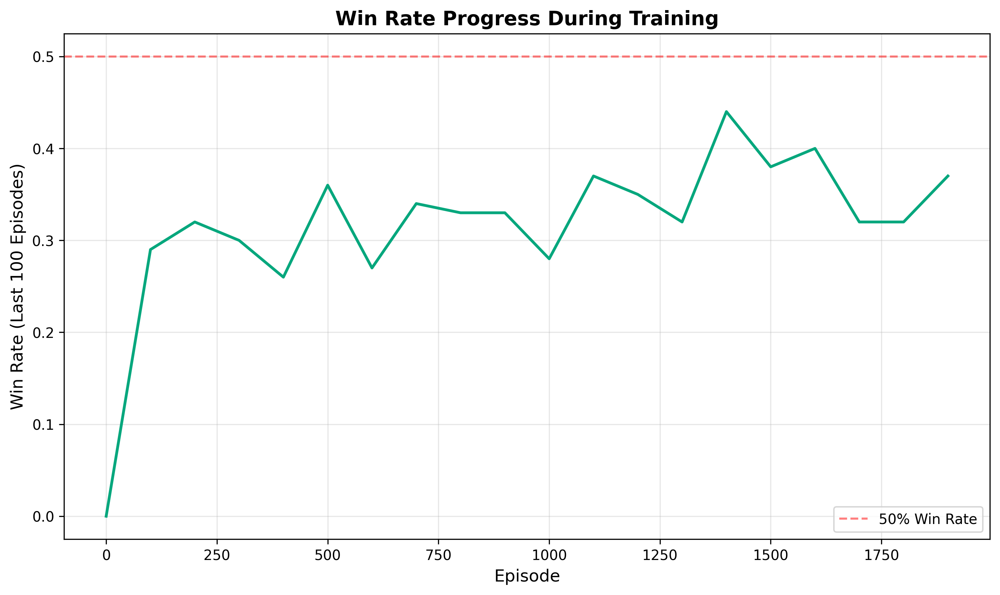
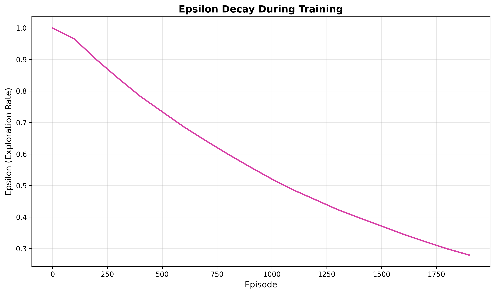

# Blackjack Reinforcement Learning

A Deep Q-Learning (DQN) agent trained to play Blackjack using the RLCard toolkit. This project demonstrates how reinforcement learning can learn optimal strategies through self-play.

## 🎯 Project Overview

This project implements a DQN agent that learns to play Blackjack by interacting with the RLCard environment. The agent improves its strategy over time through experience replay and epsilon-greedy exploration.

## 📊 Results

### Training Performance

The agent was trained for **2,000 episodes** using Deep Q-Learning with the following results:







### Evaluation Results (1,000 Episodes)

| Agent | Average Reward | Win Rate |
|-------|---------------|----------|
| **DQN Agent** | -0.030 | **44.3%** |
| Random Agent | -0.413 | 27.3% |

The DQN agent significantly outperforms the random baseline, achieving a **62% improvement** in win rate.

## 🏗️ Architecture

### DQN Network
- **Input**: State observation vector (player hand, dealer card)
- **Hidden Layers**: 2 fully connected layers (64 units each)
- **Activation**: ReLU
- **Output**: Q-values for each action (Hit/Stand)

### Training Configuration
- **Replay Buffer**: 20,000 transitions
- **Batch Size**: 64
- **Learning Rate**: 0.001
- **Gamma (Discount Factor)**: 0.99
- **Epsilon Decay**: 0.9995 (from 1.0 to 0.01)
- **Target Network Update**: Every 10 episodes

## 🚀 Getting Started

### Installation

1. **Clone the repository**:
```bash
git clone <your-repo-url>
cd poker-rl
```

2. **Create virtual environment**:
```bash
python3 -m venv poker-rl
source poker-rl/bin/activate  # On Windows: poker-rl\Scripts\activate
```

3. **Install dependencies**:
```bash
pip install -r requirements.txt
```

### Training

Train a new agent from scratch:

```bash
python -m src.train --num_episodes 2000 --save_dir models
```

**Arguments**:
- `--num_episodes`: Number of training episodes (default: 5000)
- `--save_dir`: Directory to save model and metrics (default: models)
- `--seed`: Random seed for reproducibility (default: 42)
- `--device`: Device to use (cpu/cuda, default: cpu)
- `--target_update`: Frequency of target network updates (default: 10)

### Evaluation

Evaluate a trained agent:

```bash
python -m src.evaluate --model_path models/dqn_agent.pth --num_episodes 1000
```

**Arguments**:
- `--model_path`: Path to trained model (required)
- `--num_episodes`: Number of evaluation episodes (default: 1000)
- `--seed`: Random seed (default: 42)

### Play Against the Agent

Play Blackjack with AI assistance:

```bash
python -m src.play --model_path models/dqn_agent.pth
```

The agent will suggest actions while you play!

### Generate Visualizations

Create training visualizations from saved metrics:

```bash
python -m src.visualize --metrics_path models/training_metrics.json --output_dir visualizations
```

## 📁 Project Structure

```
poker-rl/
├── src/
│   ├── __init__.py
│   ├── model.py          # DQN neural network architecture
│   ├── agent.py          # DQNAgent class with training logic
│   ├── utils.py          # Replay buffer and utilities
│   ├── train.py          # Training script
│   ├── evaluate.py       # Evaluation script
│   ├── play.py           # Interactive play interface
│   └── visualize.py      # Visualization generation
├── models/               # Saved models and metrics
├── visualizations/       # Training plots
├── requirements.txt      # Project dependencies
└── README.md
```

## 🧠 How It Works

### Deep Q-Learning (DQN)

The agent uses DQN to learn the optimal action-value function Q(s, a):

1. **Experience Collection**: Agent plays episodes, storing (state, action, reward, next_state) in replay buffer
2. **Batch Learning**: Sample random batches from buffer to break correlation
3. **Q-Value Update**: Minimize loss between predicted Q-values and target Q-values
4. **Epsilon-Greedy Exploration**: Balance exploration (random actions) and exploitation (learned policy)
5. **Target Network**: Stabilize training with a slowly-updated target network

### State Representation

RLCard provides a compact state representation including:
- Player's hand value and cards
- Dealer's visible card
- Game phase information

### Reward Structure

- **Win**: +1
- **Loss**: -1
- **Push (Tie)**: 0

## 🎓 Key Learnings

1. **Exploration vs Exploitation**: Epsilon decay is crucial for balancing learning and performance
2. **Experience Replay**: Breaking temporal correlation improves stability
3. **Target Networks**: Reduce oscillations in Q-value estimates
4. **Blackjack Complexity**: Even with optimal play, the house edge makes consistent winning challenging

## 🔮 Future Improvements

- [ ] Implement Double DQN to reduce overestimation bias
- [ ] Add Dueling DQN architecture for better value estimation
- [ ] Experiment with Prioritized Experience Replay
- [ ] Train agents for other card games (Poker, Baccarat)
- [ ] Implement tournament mode with multiple agents
- [ ] Add hyperparameter tuning with Optuna
- [ ] Create web-based GUI for interactive play

## 📚 References

- [RLCard: A Toolkit for Reinforcement Learning in Card Games](https://github.com/datamllab/rlcard)
- [Playing Atari with Deep Reinforcement Learning (DQN Paper)](https://arxiv.org/abs/1312.5602)
- [Human-level control through deep reinforcement learning (Nature DQN)](https://www.nature.com/articles/nature14236)

## 📄 License

MIT License - feel free to use this project for learning and experimentation!

## 🤝 Contributing

Contributions are welcome! Feel free to open issues or submit pull requests.

---

**Built with** ❤️ **using RLCard, PyTorch, and Deep Reinforcement Learning**

## **Contact**
For collaborations or questions, please reach out to rohansiva123@gmail.com.
